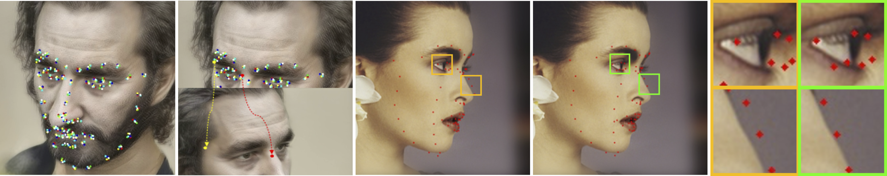

<div align="center">

# 3D-aware Facial Landmark Detection via Multiview Consistent Training on Synthetic Data

[![CC BY-NC-SA 4.0][cc-by-nc-sa-shield]][cc-by-nc-sa]

</div>



This is an official repository for the paper 
```
3D-aware Facial Landmark Detection via Multiview Consistent Training on Synthetic Data
Libing Zeng, Lele Chen, Wentao Bao, Zhong Li, Yi Xu, Junsong Yuan, Nima Kalantari
In Submission
```


## Installation
The proposed 3D-aware module can be plugged into any learning-based landmark detection algorithm. 
We applied our modual on DAD-3DNet and 3DDFA.
Please create the corresponding conda virtual environments refer to the following links respectively.
[DAD-3DNet](https://github.com/PinataFarms/DAD-3DHeads), 
[3DDFA](https://github.com/cleardusk/3DDFA)


## Demo


The visual results of Dlib, FAN, 3DDFA, our refined 3DDFA+, 3DDFA-V2, DAD-3DNet, and our refined
DAD-3DNet+ on images randomly sampled from DAD-3DHeads testing set. We show the enlarged error region (white box) in the
middle row.

### Run demo:

#### DAD-3DNet
```bash
cd dad3d
# input images are in ./images folder
# output results are in ./outputs folder

# generate results using DAD-3DNet
./shell/run_test_dad3d.sh

# generate results using DAD-3DNet+
./shell/run_test_dad3d+.sh
```

#### 3DDFA
```bash
cd 3ddfa
# input images are in ./images folder
# output results are in ./outputs folder

# generate results using 3DDFA
python demo_3ddfa.py

# generate results using 3DDFA+
python demo_3ddfa+.py
```

## Fine-Tuning


## License

This work is licensed under a
[Creative Commons Attribution-NonCommercial-ShareAlike 4.0 International License][cc-by-nc-sa].

[![CC BY-NC-SA 4.0][cc-by-nc-sa-image]][cc-by-nc-sa]

[cc-by-nc-sa]: http://creativecommons.org/licenses/by-nc-sa/4.0/
[cc-by-nc-sa-image]: https://licensebuttons.net/l/by-nc-sa/4.0/88x31.png
[cc-by-nc-sa-shield]: https://img.shields.io/badge/License-CC%20BY--NC--SA%204.0-lightgrey.svg
