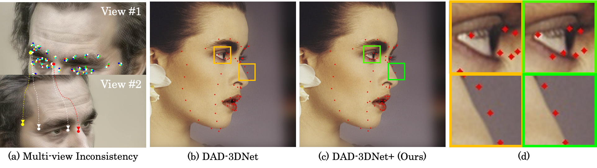

<div align="center">

# 3D-aware Facial Landmark Detection via Multiview Consistent Training on Synthetic Data

[![CC BY-NC-SA 4.0][cc-by-nc-sa-shield]][cc-by-nc-sa]

</div>



This is an official repository for the paper 
```
3D-aware Facial Landmark Detection via Multiview Consistent Training on Synthetic Data
Libing Zeng, Lele Chen, Wentao Bao, Zhong Li, Yi Xu, Junsong Yuan, Nima Kalantari
In Submission
```


## Installation
The proposed 3D-aware module can be plugged into any learning-based landmark detection algorithm. 
We applied our module on DAD-3DNet and 3DDFA.
Please create the corresponding conda virtual environments refer to the following links respectively.
[DAD-3DNet](https://github.com/PinataFarms/DAD-3DHeads), 
[3DDFA](https://github.com/cleardusk/3DDFA)


## Demo


The visual results of Dlib, FAN, 3DDFA, our refined 3DDFA+, 3DDFA-V2, DAD-3DNet, and our refined
DAD-3DNet+ on images randomly sampled from DAD-3DHeads testing set. We show the enlarged error region (white box) in the
middle row.

### Run demo:

#### DAD-3DNet
Please download checkpoints and dependent files following 
[checkpoints](https://drive.google.com/drive/folders/1JmdZwcweivDXx5_Q37TfsHQq9JogWmzo?usp=share_link), 
[dependence](https://drive.google.com/file/d/1uTuT8J7PN6YqW8XxXcCAp4Dy2pkO6Ngs/view?usp=share_link) respectively, and put them in the following paths:
```bash
# checkpoints path
landmark_consistent_plugin/dad3d/checkpoints

# dependent files path
landmark_consistent_plugin/dad3d/model_training/model/static
```

Then, run the demos using the following commands.

```bash
cd dad3d
# input images are in ./images folder
# output results are in ./outputs folder

# generate results using DAD-3DNet
./shell/run_test_dad3d.sh

# generate results using DAD-3DNet+
./shell/run_test_dad3d+.sh
```

#### 3DDFA
Please download checkpoints and dependent files following 
[checkpoints](https://drive.google.com/file/d/1l4Mh6F19ZSYHWuSNrMB-TXRqA2RzqlOu/view?usp=share_link), 
[dependence1](https://drive.google.com/file/d/1FI7qdbAkr5fauSazP5hNS4XUXvi7xVoD/view?usp=share_link) and 
[dependence2](https://drive.google.com/file/d/1l4Mh6F19ZSYHWuSNrMB-TXRqA2RzqlOu/view?usp=share_link) respectively, and put them in the following paths:

```bash
# checkpoints path
landmark_consistent_plugin/3ddfa/training/snapshot

# dependent files path
landmark_consistent_plugin/3ddfa/shape_predictor
landmark_consistent_plugin/3ddfa/train.configs
landmark_consistent_plugin/3ddfa/test.configs
landmark_consistent_plugin/3ddfa/models

```

Then, run the demos using the following commands.

```bash
cd 3ddfa
# input images are in ./images folder
# output results are in ./outputs folder

# generate results using 3DDFA
python demo_3ddfa.py

# generate results using 3DDFA+
python demo_3ddfa+.py
```

## Fine-Tuning

### Synthetic dataset generation

Please follow this link [synthetic](https://github.com/libingzeng/eg3d_pti_inv_synthetic_dataset).

We synthesize our dataset in the following steps:
1. select the subset list of images in the training dataset of DAD-3DHeads.
    - generating image list.
2. extract 68-point facial landmark from DAD-3DHeads for each selected image.
    - generating 68-point facial landmark for each image
3. crop each image along with its 68-point facial landmark.
    - generating cropped image
    - generating the estimated camera parameter of the cropped image
    - generating transferred 68-point facial lanmark
4. embed cropped image into EG3D space using EG3D-PTI-Inversion
    - generating a pivot code and adjusted weights, a NeRF, of EG3D for each cropped image
5. sample 512 views from the inverted NeRF using designed camera positions
    - generating view camera list
    - RGB image of 512 views
    - depth map of the extra view corresponding to the estimated camera parameter of the cropped image in step #3.
        - alternative: apply an exsiting facial landmark approach on #390 view, which is a frontal view, to obtain the facial landmark, and then get the depth map of this view.
6. calculate facial landmarks for the sampled 512 views based on the cameras, and the depth map.
    - generating facial landmark for each sampled view.

After these steps, we obtain the following things, which make our synthetic dataset:
* the subset list of images in the training dataset of DAD-3DHeads.
* shared camera list for sampling 512 views.
* 512 multiview images for each cropped selected image.
* facial landmark for each multivew image.


### Run fine-tuning

We have applied our plugin module on DAD-3DNet and 3DDFA, so in this section we show how to use our method on them respectively.

Please download the original dataset of training DAD-3DNet and 3DDFA refer to the following links respectively.
[DAD-3DNet](https://github.com/PinataFarms/DAD-3DHeads), 
[3DDFA](https://github.com/cleardusk/3DDFA)

#### DAD-3DNet fine-tuning
Due to the resuming trainable checkpoint of DAD-3DNet is not public available, we first retrain DAD-3DNet in the same way as they explained in the paper, and the do our fine-tuning.

```bash
cd dad3d

# retrain DAD-3DNet
./shell/run_train_68.sh

```

Fine-tuning dataset setting is in the file:
```bash
# line #3 - #5
landmark_consistent_plugin/dad3d/model_training/config/dataset/dad_3d_heads_consistent_68.yaml
```

Please run the following code to do fine-tuning.
```bash
# fine-tuning DAD-3DNet
./shell/run_train_consistent_68_all.sh
```

#### 3DDFA fine-tuning

Fine-tuning dataset setting is in the file:
```bash
# line #388 - #402
landmark_consistent_plugin/3ddfa/training/train_booster.py
```

Please run the following code to do fine-tuning.
```bash
cd 3ddfa

# fine-tuning 3DDFA
./training/train_wpdc_booster.sh
```

## Acknowledgement
We applied our module on DAD-3DNet and 3DDFA and used their code in our implementation.
Thanks for their excellent works.
[DAD-3DNet](https://github.com/PinataFarms/DAD-3DHeads), 
[3DDFA](https://github.com/cleardusk/3DDFA)


## Citation

If you find our code useful, please cite the following paper:

```
@inproceedings{zeng_3dlandmark_2022,
    title={3D-aware Facial Landmark Detection via Multiview Consistent Training on Synthetic Data},
    author={Zeng, Libing and Chen, Lele and Bao, Wentao and Li, Zhong and Xu, Yi and Yuan, Junsong and Kalantari, Nima},
    booktitle = {XXXX},
    year={2022}
}
```


## License

This work is licensed under a
[Creative Commons Attribution-NonCommercial-ShareAlike 4.0 International License][cc-by-nc-sa].

[![CC BY-NC-SA 4.0][cc-by-nc-sa-image]][cc-by-nc-sa]

[cc-by-nc-sa]: http://creativecommons.org/licenses/by-nc-sa/4.0/
[cc-by-nc-sa-image]: https://licensebuttons.net/l/by-nc-sa/4.0/88x31.png
[cc-by-nc-sa-shield]: https://img.shields.io/badge/License-CC%20BY--NC--SA%204.0-lightgrey.svg
